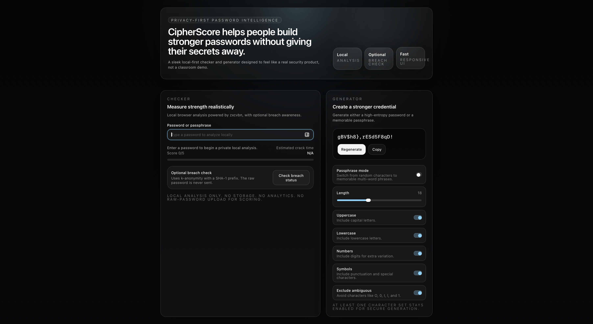
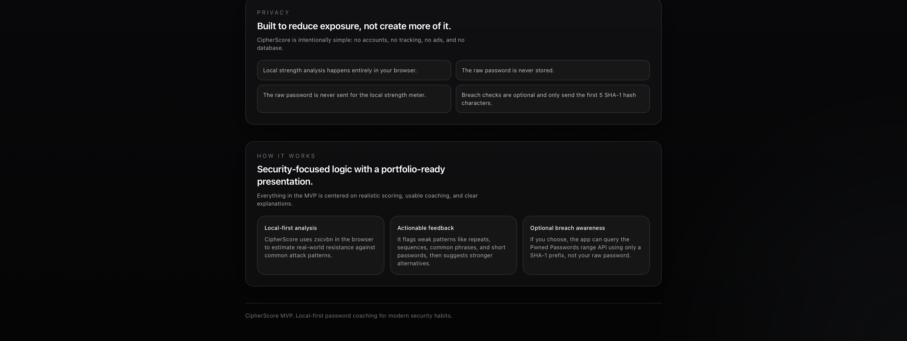

# CipherScore

CipherScore is a privacy-first password strength checker and generator built with Next.js, TypeScript, Tailwind CSS, and zxcvbn. It analyzes passwords locally in the browser, offers optional breached-password checking with k-anonymity, and presents the whole experience in a polished dark UI designed for a portfolio.

## Screenshots




## In Simple Terms

CipherScore helps users check how strong their passwords are and generate better ones. It runs password analysis locally in the browser for privacy, gives security feedback, and includes an optional breach check that does not send the raw password.

## Product plan

- Build one focused landing page with two core utilities: a password checker and a password generator.
- Keep all strength estimation local in the browser using `zxcvbn`.
- Add an optional Have I Been Pwned range query so only a SHA-1 prefix leaves the client during breach checks.
- Prioritize a premium, minimal UI that feels startup-quality rather than classroom-demo quality.
- Keep the codebase intentionally small, readable, and easy to run.

## File structure

```text
.
├── app
│   ├── api/breach-check/route.ts
│   ├── globals.css
│   ├── layout.tsx
│   └── page.tsx
├── components
│   ├── password-checker.tsx
│   ├── password-generator.tsx
│   └── section-shell.tsx
├── lib
│   └── password-generator.ts
├── README.md
├── next.config.mjs
├── package.json
├── postcss.config.js
├── tailwind.config.ts
└── tsconfig.json
```

## Feature breakdown

- Local password strength analysis with `zxcvbn`
- Support for passwords and passphrases
- Actionable warnings for short length, repeated patterns, keyboard patterns, and common words
- Estimated crack time display
- Strength label and score display
- Show or hide password input
- Optional breached-password check using SHA-1 prefix k-anonymity
- Secure password generator with character-set controls
- Passphrase generator mode
- Copy-to-clipboard for generated output
- Accessible keyboard-friendly UI with clear contrast and labels

## UI breakdown

- Hero section with strong product framing
- Main checker card for analysis and breach checking
- Generator card for passwords and passphrases
- Privacy section explaining local-first behavior
- How it works section for portfolio reviewers
- Minimal footer

## Security and privacy approach

- Password scoring runs in-browser only
- Raw passwords are never stored
- Raw passwords are never sent for local strength analysis
- Breach checks are optional
- Breach checks only send the first 5 SHA-1 characters to the upstream range API
- No login, no database, no analytics, no ads

## Why this is different

Most password checkers are either simplistic score meters or privacy-light marketing tools. CipherScore is different because it combines realistic client-side analysis, actionable coaching, optional breach awareness, and a genuinely polished interface in one minimal product. The app is designed to show both engineering judgment and product thinking.

## Stack

- Next.js 14
- TypeScript
- Tailwind CSS
- zxcvbn

## Setup

1. Install dependencies:

```bash
npm install
```

2. Start the development server:

```bash
npm run dev
```

3. Open [http://localhost:3000](http://localhost:3000)

## Design choices

- `zxcvbn` was chosen over regex-only scoring because it better models realistic human password behavior.
- The dark graphite palette helps the product feel premium and security-focused.
- The UI is intentionally compact and uncluttered so the privacy message stays clear.
- The breach check is separated from the default flow so the local-first promise stays obvious.

## Suggested repo description

Privacy-first password strength checker and generator built with Next.js, TypeScript, Tailwind, and zxcvbn, with optional k-anonymity breach checks.

## Suggested GitHub tags

`nextjs`, `typescript`, `tailwindcss`, `zxcvbn`, `password-checker`, `password-generator`, `privacy-first`, `cybersecurity`, `portfolio-project`

## Future improvements

1. Add a richer passphrase word list and localization support.
2. Add offline caching for breach-prefix responses to reduce repeated lookups.
3. Visualize password entropy and attack scenarios in more depth.
4. Add unit tests for generator logic and breach parsing.
5. Add side-by-side comparisons between weak and improved password examples.
